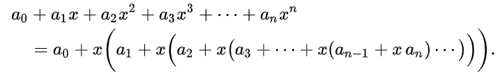

# Алгоритмы

### Введение в алгоритмы

Список задач

| Задача                                          | Описание                                               |
| ----------------------------------------------- | ------------------------------------------------------ |
| [A. Значения функции](introduction/A.js)        |                                                        |
| [B. Чётные и нечётные числа](introduction/B.js) |                                                        |
| [C. Соседи](introduction/C.js)                  | Возвращает всех соседей элемента **матрицы**           |
| [D. Хаотичность погоды](introduction/D.js)      | Вычисляет длину последовательности                     |
| [E. Самое длинное слово](introduction/E.js)     | Возвращает самое длинное слово в строке                |
| [F. Палиндром](introduction/F.js)               | Проверяет является ли строка палиндромом               |
| [G. Работа из дома](introduction/G.js)          | Переводит целое число из десятичной системы в двоичную |
| [H. Двоичная система](introduction/H.js)        | Складывает две строки в двоичной системе счисления     |
| ...                                             |                                                        |
| [Y. Ближайший ноль](introduction/Y.js)          | Считает расстояния до ближайшего нуля за O(n)          |
| [Z. Ловкость рук](introduction/Z.js)            | Считает сумму элементов в **матрице**                  |

> [_Контест 1_](https://contest.yandex.ru/contest/22449/problems/), [_Контест 2_](https://contest.yandex.ru/contest/22450/problems/)

### Основные структуры данных

Список задач

| Задача                                                      | Описание                           |
| ----------------------------------------------------------- | ---------------------------------- |
| [B. Список дел](basicDataStructures/B.js)                   |                                    |
| [C. Нелюбимое дело](basicDataStructures/C.js)               |                                    |
| [D. Заботливая мама](basicDataStructures/D.js)              |                                    |
| [E. Всё наоборот](basicDataStructures/E.js)                 |                                    |
| [F. Стек - Max](basicDataStructures/F.js)                   |                                    |
| [H. Скобочная последовательность](basicDataStructures/H.js) |                                    |
| ...                                                         |                                    |
| [Y. Дек](basicDataStructures/Y.js)                          | [README](basicDataStructures/Y.md) |
| [Z. Калькулятор](basicDataStructures/Z.js)                  | [README](basicDataStructures/Z.md) |

### Рекурсия и сортировки

Список задач

| Задача                                                                   | Описание                                     |
| ------------------------------------------------------------------------ | -------------------------------------------- |
| [A. Генератор скобок (бектрекинг)](recursionAndSorting/ABacktracking.js) | Генерация скобочных последовательностей      |
| [A. Генератор скобок (фильтрация ПСП)](recursionAndSorting/AStack.js)    | Генерация всех скобочных последовательностей |
| [B. Комбинации](recursionAndSorting/B.js)                                |                                              |
| [C. Подпоследовательность](recursionAndSorting/C.js)                     |                                              |
| [H. Большое число](recursionAndSorting/H.js)                             |                                              |
| [J. Пузырёк](recursionAndSorting/J.js)                                   |                                              |
| [K. Сортировка слиянием](recursionAndSorting/J.js)                       |                                              |
| [L. Два велосипеда](recursionAndSorting/L.js)                            |                                              |
| [N. Клумбы](recursionAndSorting/N.js)                                    |                                              |
| ...                                                                      |                                              |
| [Y. Поиск в сломанном массиве](recursionAndSorting/Y.js)                 | [README](recursionAndSorting/Y.md)           |
| [Z. Эффективная быстрая сортировка](recursionAndSorting/Z.js)            | [README](recursionAndSorting/Z.md)           |

> [_Контест 1_](https://contest.yandex.ru/contest/23638/problems/), [_Контест 2_](https://contest.yandex.ru/contest/23815/problems/)

### Хэш-функции

Список задач

| Задача                                                                        | Описание                                                                    |
| ----------------------------------------------------------------------------- | --------------------------------------------------------------------------- |
| [A. Полиномиальный хеш](hashFunctions/A.js)                                   | Находит полиномиальный хеш методом Горнера:  |
| [B. Сломай меня](hashFunctions/B.js)                                          | Находит 2 строки с одинаковым хэшем                                         |
| [C. Префиксные хеши](hashFunctions/C.js)                                      | Находит хэши в подстроке                                                    |
| [D. Кружки](hashFunctions/D.js)                                               |                                                                             |
| [G. Соревнование](hashFunctions/G.js)                                         | Создает мапу из одинаковых сумм, затем вычисляет максимальную дистанцию     |
| [H. Странное сравнение](hashFunctions/H.js)                                   | Сравнивает набор символов в строке с помощью мапы                           |
| [Y. Поисковая система](hashFunctions/Y.js)                                    | [README](hashFunctions/Y.md)                                                |
| [Z. Хеш-таблица (метод цепочек)](hashFunctions/ZChains.js)                    | [README](hashFunctions/Z.md)                                                |
| [Z. Хеш-таблица (метод открытой адресации)](hashFunctions/ZOpenAddressing.js) |                                                                             |

> [_Контест 1_](https://contest.yandex.ru/contest/23991/problems/), [_Контест 2_](https://contest.yandex.ru/contest/24414/problems/)

### Деревья

Список задач

| Задача                                    | Описание                                                                                                                                 |
| ----------------------------------------- | ---------------------------------------------------------------------------------------------------------------------------------------- |
| [A. Лампочки](trees/A.js)                 | Находит самое большое значение в дереве                                                                                                  |
| [B. Сбалансированное дерево](trees/B.js)  | Проверяет, сбалансированно дерево или нет                                                                                                |
| [E. Дерево поиска](trees/E.js)            | Определяет, является ли заданное дерево деревом поиска                                                                                   |
| [I. Разные деревья поиска](trees/I.js)    | Считает количество корневых бинарных деревьев с n листьями с помощью чисел [Каталана](https://e-maxx.ru/upload/e-maxx_algo.pdf#page=427) |
| [J. Добавь узел](trees/J.js)              | Вставка ключа в BST                                                                                                                      |
| [K. Выведи диапазон](trees/K.js)          | Центрированный LMR обход дерева                                                                                                          |
| [L. Просеивание вниз](trees/L.js)         | Совершает просеивание вниз в куче на максимум                                                                                            |
| [M. Просеивание вверх](trees/M.js)        | Совершает просеивание вверх в куче на максимум                                                                                           |
| [Y. Пирамидальная сортировка](trees/Y.js) | [README](trees/Y.md)                                                                                                                     |
| [Z. Удали узел](trees/Z.js)               | [README](trees/Z.md)                                                                                                                     |

> [_Контест 1_](https://contest.yandex.ru/contest/24809/problems/), [_Контест 2_](https://contest.yandex.ru/contest/24810/problems/)

### Графы

Список задач

| Задача                                                       | Описание                                                                                             |
| ------------------------------------------------------------ | ---------------------------------------------------------------------------------------------------- |
| [A. Построить список смежности](graphs/A.js)                 | По списку рёбер графа строит его список смежности                                                    |
| [B. Перевести список ребер в матрицу смежности](graphs/B.js) | Переводит список рёбер ориентированного графа в матрицу смежности                                    |
| [C. DFS](graphs/C.js)                                        | Обходит с помощью DFS все вершины неориентированного графа и выводит их                              |
| [E. Компоненты связности](graphs/E.js)                       | Находит компоненты связности неориентированного графа                                                |
| [H. Время выходить](graphs/H.js)                             | Находит время входа и выхода при обходе в глубину ориентированного графа                             |
| [J. Топологическая сортировка](graphs/J.js)                  | Находит топологическую сортировку ациклического ориентированного графа (DAG, directed acyclic graph) |
| [Y. Дорогая сеть](graphs/Y.js)                               | [README](graphs/Y.md)                                                                                |
| [Z. Железные дороги](graphs/Z.js)                            | [README](graphs/Z.md)                                                                                |

> [_Контест 1_](https://contest.yandex.ru/contest/25069/problems/), [_Контест 2_](https://contest.yandex.ru/contest/25070/problems/)

### Жадные алгоритмы

Список задач

| Задача                                                      | Описание                                                                  |
| ----------------------------------------------------------- | ------------------------------------------------------------------------- |
| [A. Биржа](greedyAlgorithms/A.js)                           | Считает жадную выгоду                                                     |
| [B. Расписание](greedyAlgorithms/B.js)                      | Составляет жадное расписание                                              |
| [C. Золотая лихорадка](greedyAlgorithms/C.js)               | Решает задачу о рюкзаке жадным алгоритмом                                 |
| [F. Прыжки по лестнице](greedyAlgorithms/F.js)              | Решает задачу методом динамического программирования                      |
| [H. Поле с цветочками](greedyAlgorithms/H.js)               | Решает задачу методом двумерного динамического программирования           |
| [K. Гороскопы](greedyAlgorithms/K.js)                       | Находит наибольшую общую подпоследовательность                            |
| [L. Золото лепреконов](greedyAlgorithms/LOneDimensional.js) | Решает задачу о рюкзаке методом динамического программирования            |
| [L. Золото лепреконов](greedyAlgorithms/LTwoDimensional.js) | Решает задачу о рюкзаке методом двумерного динамического программирования |
| [Y. Расстояние по Левенштейну](greedyAlgorithms/Y.js)       | [README](greedyAlgorithms/Y.md)                                           |
| [Z. Одинаковые суммы](greedyAlgorithms/Z.js)                | [README](greedyAlgorithms/Z.md)                                           |

> [_Контест 1_](https://contest.yandex.ru/contest/25596/problems/), [_Контест 2_](https://contest.yandex.ru/contest/25597/problems/)

### Алгоритмы на строках

Список задач

| Задача                             | Описание                     |
| ---------------------------------- | ---------------------------- |
| [A. Разворот строки](strings/A.js) | Переворачивает порядок слов  |
| [E. Вставка строк](strings/E.js)   | Вставляет подстроки в строку |

> [_Контест 1_](https://contest.yandex.ru/contest/26131/problems/)

